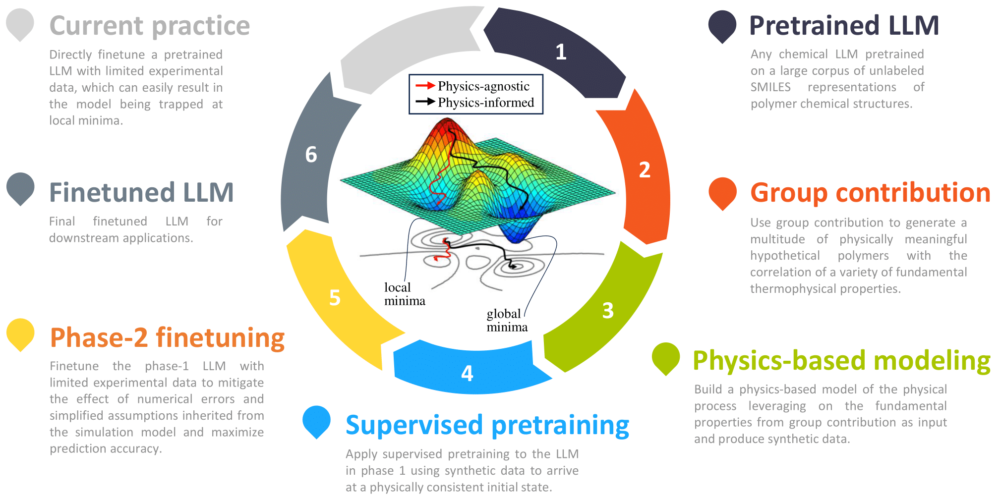

# Large language models, physics-based modeling, experimental measurements: the trinity of data-scarce learning of polymer properties

This is the official implementation of TrinityLLM:

Ning Liu, Siavash Jafarzadeh, Brian Y Lattimer, Shuna Ni, Jim Lua, Yue Yu. "[Large language models, physics-based modeling, experimental measurements: the trinity of data-scarce learning of polymer properties](https://arxiv.org/abs/2407.02770)".




Large language models (LLMs) bear promise as a fast and accurate material modeling paradigm for evaluation, analysis, and design. Their vast number of trainable parameters necessitates a wealth of data to achieve accuracy and mitigate overfitting. However, experimental measurements are often limited and costly to obtain in sufficient quantities for finetuning. To this end, we present a physics-based training pipeline that tackles the pathology of data scarcity. The core enabler is a physics-based modeling framework that generates a multitude of synthetic data to align the LLM to a physically consistent initial state before finetuning. Our framework features a two-phase training strategy: (1) utilizing the large-in-amount while less accurate synthetic data for supervised pretraining, and (2) finetuning the phase-1 model with limited experimental data. We empirically demonstrate that supervised pretraining is vital to obtaining accurate finetuned LLMs, via the lens of learning polymer flammability metrics where cone calorimeter data is sparse.

## Requirements

We use the apex.optimizers in our code, and thus Apex needs to be compiled from source. A step-by-step instruction is provided in [environment.md](environment.md)


## Pretraining Datasets

The pretraining datasets are available via the [MoLFormer repo](https://github.com/IBM/molformer) and can be downloaded [here](https://ibm.box.com/v/MoLFormer-data). We briefly reproduce the instructions below.

Due to the large nature of the combination of the PubChem and Zinc (over 1.1 billion molecules in total) datasets, the code expects the data to be in a certain location and format. The details of this processing is documented below for each individaul dataset.

The code expects both the zinc15(ZINC) and pubchem datasets to be located in he ```./data/``` directory of the training directory.
  * Zinc15 itself should be located in ```data/ZINC/``` and is expected to be processed in multiple smi files which contains one smiles string per line.
  * PubChem should be located in ```data/pubchem/``` and is expected to be processed as a single “CID-SMILES” text file with 2 columns (index and smiles string).  We take the raw Pubchem dataset and convert every smiles molecule into the canonical form, utilizing rdkit, as well as trimmed down the file itself. Our dataloader expects Pubchem to be in our converted form and will not run on the raw pubchem file.

```
data/
├── pubchem
│   └── CID-SMILES-CANONICAL.smi
└── ZINC
    ├── AAAA.smi
    ├── AAAB.smi
    ├── AAAC.smi
    ├── AAAD.smi
    ├── AABA.smi
    ├── AABB.smi
    ├── AABD.smi
    ├── AACA.smi
    ├── AACB.smi
    ├── AAEA.smi
    ├── AAEB.smi
    ├── AAED.smi
    ├── ABAA.smi
    ├── ABAB.smi
    ├── ABAC.smi
    ├── ABAD.smi
    ├── ABBA.smi
    ├── ABBB.smi
    ├── ABBD.smi
    ├── ABCA.smi
    ├── ABCB.smi
    ├── ABCD.smi
    ├── ABEA.smi
    ├── ABEB.smi
    ├── ABEC.smi
    ├── ABED.smi
    ├── ACAA.smi
    ├── ACAB.smi
```

#### Pretrained Models and training logs
The checkpoints of MoLFormer encoders pre-trained on a dataset of ~100M molecules are available for [download](https://ibm.box.com/v/MoLFormer-data). This dataset combines 10% of Zinc and 10% of PubChem molecules used for MoLFormer-XL training.

Extract `Pretrained MoLFormer.zip` containing the pretrained models and the associated training logs to the `./data/` directory.
The hierarchy looks like the following:

```
data/
├── Pretrained MoLFormer
│   ├── checkpoints
│   │   ├── N-Step-Checkpoint_0_0.ckpt
│   │   ├── N-Step-Checkpoint_0_5000.ckpt
│   │   ├── N-Step-Checkpoint_1_10000.ckpt
│   │   ├── N-Step-Checkpoint_1_15000.ckpt
│   │   ├── N-Step-Checkpoint_2_20000.ckpt
│   │   ├── N-Step-Checkpoint_3_25000.ckpt
│   │   └── N-Step-Checkpoint_3_30000.ckpt
│   ├── events.out.tfevents.1643396916.cccxc543.3427421.0
│   └── hparams.yaml
```

## Pretraining
To train a model from scratch, the masked language model approach is utilized.

Note that the trinityLLM framework can be applied to any polymer LLM. We use MoLFormer as an example in the following demonstration. MoLFormer is pre-trained on canonicalized SMILES of >1 B molecules from ZINC and PubChem with the following constraints:

During pre-processing, the compounds are filtered to keep a maximum length of 211 characters. A 100/0/0 split was used for training, validation, and test, i.e. we used all the data for training the model. As a confidence test, we would evaluate the model at the end of each epoch with additional independent data. Data canonicalization is performed using RDKit.

The pre-training code provides an example of data processing and training of a model trained on a smaller pre-training dataset size, which requires 16 v100 GPUs.

To train a model, run:

> bash run_pubchem_light.sh

## Finetuning

The finetuning related datasets need to be put in the corresponding folder as specified in the bash script below. Once you have the environment set up, you can run a fine-tune task by running

> bash fire_run_finetune_density.sh

Finetuning training/checkpointing resources will be available in the directory named ```checkpoint_<measure_name>```. The path to the results csv will be in the form of ```./checkpoint_<measure_name>/<measure_name>/results/results_.csv```. The ```results_.csv``` file contains 4 columns of data. Column one contains the validation score for each epoch while column 2 contains the test score for each epoch. Column 3 contains the best validation score observed up to that point of fine tuning while column 4 is the test score of the epoch which had the best validation score.

To perform the two-phase finetuning as discussed in the paper, simply pretrain a LLM model using physics-based synthetic data in the first phase, and load the trained model in the second phase and use limited experimental data for further finetuning.

## Running trained TrinityLLM models

The trained models in the paper are available for download [here](https://drive.google.com/drive/folders/1l_GlVGW49iqu1Q8QpcJxEveaomjy2Z8a?usp=sharing).

To load a trained model and directly make predictions (note that the trained checkpoints need to be put in the corresponding folder as specified in the bash file), run:

> bash fire_predict_density.sh

## Citation

If you find this repository useful, please consider citing our paper:
```latex
@article{liu2024large,
  title={Large language models, physics-based modeling, experimental measurements: the trinity of data-scarce learning of polymer properties},
  author={Liu, Ning and Jafarzadeh, Siavash and Lattimer, Brian Y and Ni, Shuna and Lua, Jim and Yu, Yue},
  journal={arXiv preprint arXiv:2407.02770},
  year={2024}
}
```

## Acknowledgments
This repository is constructed using the codebase from [MoLFormer](https://github.com/IBM/molformer).
